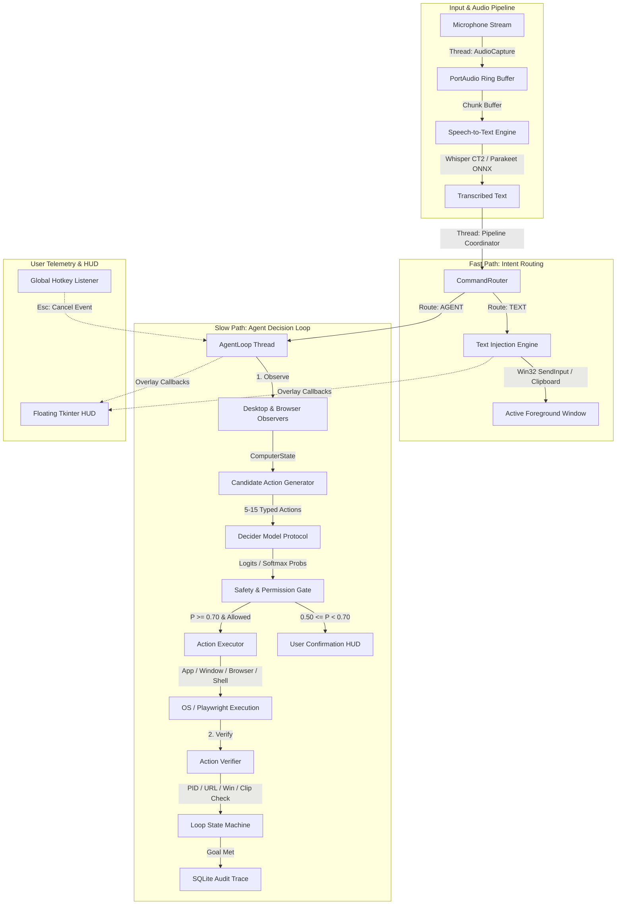

# 🏛️ PASTA V2 Architecture Specification

## 1. High-Level System Architecture

PASTA V2 is designed as a modular, local-first system with strict separation of concerns across concurrent threads. The system bridges local bilingual speech recognition with structured finite-action agent decision models.



---

## 2. Concurrency & Threading Architecture

PASTA runs **five independent threads** to ensure the user interface and audio capture never stutter or block during heavy model inference or browser operations:

1. **Audio Capture Thread (`pasta.audio.AudioCapture`)**:
   - PortAudio non-blocking stream sampling at 16,000 Hz, 16-bit mono.
   - Pushes raw audio frames into a thread-safe queue.
2. **STT Transcription Worker (`pasta.pipeline.VoicePipeline`)**:
   - Consumes audio chunks, calculates root-mean-square (RMS) energy, and runs inference through either `WhisperCT2Engine` or `ParakeetOnnxEngine`.
3. **Tkinter Main GUI Thread (`pasta.overlay.FloatingOverlay`)**:
   - Runs the floating frameless transparent HUD on Windows (`topmost`, `toolwindow`).
   - Dynamically transitions between **Voice Mode** (waveform visualizer) and **Agent Mode** (goal, action, step, confidence telemetry).
4. **Agent Loop Thread (`pasta.agent.loop.AgentLoop`)**:
   - Dedicated background daemon thread executing the multi-step observe-propose-score-execute-verify cycle.
   - Listens to `cancel_event` to immediately break on `Esc` key press.
5. **Playwright Async/Sync Browser Context (`pasta.agent.actions.browser.BrowserManager`)**:
   - Lazy singleton managing an isolated Chromium instance for web navigation and DOM extraction.

---

## 3. Fast Intent Classification (`CommandRouter`)

The router executes in `< 1ms` using compiled regexes across English and Greek:
- **Prefix Matching**: `"pasta"`, `"hey pasta"`, `"ok pasta"`, `"computer"`, `"system"`, `"πάστα"`, `"παστα"`, `"υπολογιστή"`, `"κομπιούτερ"`.
- **Imperative Intent Matching**: Direct action verbs without prefix (e.g., `"open notepad"`, `"άνοιξε το chrome"`, `"switch to vscode"`, `"mute sound"`).
- **Stop Intercept**: `"stop"`, `"cancel"`, `"halt"`, `"σταμάτα"`, `"άκυρο"` immediately trigger cancellation.
- **Normal Dictation**: Conversational sentences, punctuation, and prose route directly to `RouteType.TEXT` to avoid agent inference latency.

---

## 4. State Representation (`ComputerState`)

At each agent step, PASTA observes the current environment into a frozen dataclass:
- `timestamp`: Epoch seconds.
- `focused_window`: Handle (HWND), process ID, executable name, window title, and bounding coordinates via `win32gui` and `uiautomation`.
- `open_windows`: Filtered list of non-minimized, non-tool top-level user application windows.
- `browser`: Active URL, page title, interactive DOM elements (buttons, inputs, links with CSS selectors and bounding rects).
- `clipboard_text`: Current system clipboard snippet.

---

## 5. Finite Candidate Generation (`CandidateBuilder`)

Unlike traditional unconstrained LLM computer agents that generate raw coordinates `(x, y)` or arbitrary text tokens, PASTA constructs a **finite, valid action space** $A = \{a_1, a_2, \dots, a_N\}$ where $5 \le N \le 15$:

1. **Environmental Actions**: Focus/minimize/close open windows discovered in `ComputerState.open_windows`.
2. **Targeted Intent Actions**: Launch applications, open folders (Downloads, Documents), search files, click DOM selectors matching the user's intent.
3. **Safety Fallback Actions**: Always includes `stop` and `focus_active_window`.

Every candidate action is an instance of `AgentAction`:
```python
@dataclass
class AgentAction:
    id: str
    description: str
    category: str
    risk: RiskLevel  # READ, LOW, MEDIUM, HIGH, DESTRUCTIVE
    execute: Callable[[], ActionResult]
    verify: Callable[[], bool]
```

---

## 6. Decision Models Protocol (`DecisionModel`)

Models conform to a uniform protocol:
```python
@runtime_checkable
class DecisionModel(Protocol):
    def score_candidates(
        self,
        task: str,
        state: ComputerState,
        candidates: list[AgentAction]
    ) -> list[Decision]: ...
```

Three implementations are provided:
1. **`DeciderPyTorchModel`**:
   - Uses `Mapika/decider-2b` with HuggingFace PyTorch runtime on CUDA.
   - Evaluates action logits conditioned on task and state prompt.
2. **`DeciderGGUFModel`**:
   - Uses `llama-cpp-python` for quantized CPU/GPU deployment with low memory footprint.
3. **`MockDecisionModel`**:
   - High-speed offline deterministic heuristic scorer for CI, testing, and offline fallback.

---

## 7. Safety Gates & Confirmation

Action execution is gated by `pasta.agent.safety.SafetyController`:

$$\text{Confidence Tier} = \begin{cases} 
\text{Auto-Execute} & \text{if } P(a^*) \ge 0.70 \text{ and } \text{Risk} < \text{DESTRUCTIVE} \\
\text{Require Confirmation} & \text{if } 0.50 \le P(a^*) < 0.70 \text{ or } \text{Risk} = \text{DESTRUCTIVE} \\
\text{Abstain / Clarify} & \text{if } P(a^*) < 0.50 
\end{cases}$$

Permissions can be toggled individually in `config.json`:
- `allow_app_launch`
- `allow_window_control`
- `allow_browser_automation`
- `allow_shell_commands`
- `allow_file_system`

---

## 8. Action Verification & Loop Control

After an action executes, the `ActionVerifier` inspects the environment to verify success:
- **`verify_window_focused(title)`**: Polls active HWND title.
- **`verify_process_running(proc_name)`**: Inspects running PIDs.
- **`verify_browser_url(url_substring)`**: Checks Playwright active URL.
- **`verify_file_opened(filename)`**: Checks window title or PID.
- **`verify_clipboard_has_text()`**: Verifies clipboard buffer populated.

If verification fails, the agent loop records the failure, updates `TaskState.history`, and adjusts subsequent candidate scoring. The loop terminates when:
1. A terminal action (`stop` or goal-completed action) succeeds.
2. Max steps (`config.agent.max_steps = 5`) is reached.
3. Repetitive action loop is detected.
4. User presses **`Esc`** or issues a voice cancel command.

---

## 9. Telemetry & SQLite Audit Trace

All runs are recorded in `pasta.history_db.HistoryDB`:
- Table `history`: Audio dictation transcriptions with timestamps and languages.
- Table `agent_runs`:
  - `run_id`: UUID string.
  - `timestamp`: ISO timestamp.
  - `task`: Voice command transcription.
  - `selected_action`: Winning action ID and category.
  - `confidence`: Confidence score $P(a^*)$.
  - `candidates_json`: Full list of proposed candidate descriptions and probabilities.
  - `success`: Execution boolean.
  - `verification`: Verification boolean.
  - `error_message`: Error details if failed.
  - `elapsed_ms`: Total execution time in milliseconds.
