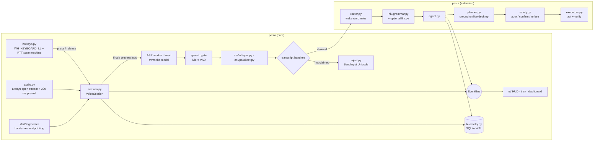

# Architecture

PESTO is the voice-input layer; PASTA is an extension that claims some
transcripts as commands. PESTO never imports PASTA.



## Threads

| Thread | Owns | Notes |
|---|---|---|
| Qt GUI (main) | HUD, tray, dashboard | receives everything via `UiBridge` signals (queued) |
| `KeyboardHook` | `WH_KEYBOARD_LL` message loop | callback does dict lookups only, then queues; Windows silently removes slow hooks |
| `HotkeyDispatch` | PTT/combo callbacks | the session's input handlers run here |
| PortAudio callback | the current `Recording` | copies samples, nothing else |
| `AudioFrames` | hands-free VAD | Silero per 32 ms frame |
| `AsrWorker` | the ASR model | **all** loading, unloading and inference: no GPU locking needed |
| `PreviewTicker` | live preview scheduling | schedules a preview only when the worker is idle |
| `TelemetryWriter` | SQLite connection | disk latency can never delay text |
| `PastaRun` | one command run | cancellable at every step |

## The dictation path and its timeline

Every interaction records `perf_counter` marks; telemetry stores the derived spans:

```
press ─ confirm(150 ms) ─ … speech … ─ speech_end ─ release ─ asr_queue_end ─ gate ─ asr ─ route ─ [delay] ─ inject ─ done
                                       └──────────── speech_end_to_text_ms ───────────────────────────────────┘
                                                     └──────────── release_to_text_ms ──────────────────────────┘
```

* `queue_ms`: release → ASR start (non-zero only when a live preview was running);
* `gate_ms`: Silero speech gate (skips the model entirely for empty presses);
* `asr_ms`, with the engine's own breakdown (`features`, `encode`, `langid`, `decode`);
* `added_delay_ms`: the experimental manipulation (0 in normal use), kept separate;
* `inject_ms`: includes waiting for physical modifier keys to be released.

## Key design decisions

| Decision | Why |
|---|---|
| Whisper decoded from a single encoder pass with el/en-restricted language ID | faster-whisper's auto-language path ran the encoder twice; unrestricted LID labelled short Greek clips as Portuguese, Hebrew or Korean (seen in the old logs) |
| Prompt chosen after language ID | a fixed Greek prompt pushed English speech into Greek (51 % WER) |
| Speech gate before ASR | avoids Whisper hallucinations on silence and a full encoder pass per accidental press |
| Virtual-key-code hook instead of the `keyboard` library | key *names* depend on the active layout (Greek/English); the library is unmaintained and cannot recognise our own injected input |
| Hold threshold + chord detection | Right Ctrl is also a modifier: Right Ctrl+C must stay a copy |
| `SendInput` Unicode instead of clipboard + Ctrl+V | no clipboard clobbering; clipboard path kept for long text / RDP and restores the user's clipboard |
| One worker owns the model | serialises GPU work without locks; finals always pre-empt queued previews |
| PyTorch never imported | ~4.6 s faster start, no second CUDA context; CUDA DLLs registered explicitly (`pesto/cuda.py`) |
| Parakeet: fp32 on CUDA, int8 on CPU, cuDNN heuristic algorithm search | int8 kernels are slow on the CUDA provider; exhaustive search re-benchmarks every new utterance length |
| PASTA as an extension (transcript handler) | PESTO stays a small, dependable dictation tool; PASTA adds no code to its hot path |
| Deterministic grammar first, LLM only as a confirmation-gated fallback | sub-millisecond, predictable, testable; a model widens what is *understood*, never what runs unasked |
| Ground each step right before running it | "open Notepad and type …" types into the Notepad step 1 actually opened |
| Verification reports `unverified` instead of success when an effect is unobservable | the old verifier returned success for almost everything |

## Configuration

`config.json` (data home) has sections `general`, `asr`, `audio`, `input`,
`inject`, `ui`, `experiment` (core) and `agent`, `permissions` (PASTA). Old flat
PESTO v5 / PASTA v2 files are migrated on load; sections owned by an extension
that is not running are preserved.

## Data locations

Source checkout: everything under the repository (`config.json`, `cache/huggingface`,
`data/pesto.db`, `logs/`). Installed: `%LOCALAPPDATA%\PESTO`. Override with `PESTO_HOME`.
