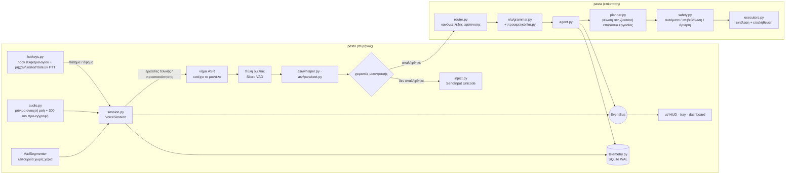

# Αρχιτεκτονική

Το σύστημα αποτελείται από δύο επίπεδα:

* **PESTO** — ο πυρήνας φωνητικής εισαγωγής κειμένου: κρατάς πλήκτρο → μιλάς →
  αφήνεις → το κείμενο εμφανίζεται εκεί που βρίσκεται ο κέρσορας.
* **PASTA** — επέκταση του PESTO για φωνητικές εντολές («Πάστα, άνοιξε το Chrome»).
  Εγγράφεται ως *χειριστής μεταγραφών*: αν μια εκφώνηση είναι εντολή, την αναλαμβάνει·
  αλλιώς το κείμενο πληκτρολογείται κανονικά.

Ο πυρήνας **δεν εξαρτάται** από την επέκταση: το PESTO λειτουργεί αυτόνομα, και το
PASTA δεν προσθέτει κώδικα στην κρίσιμη διαδρομή της υπαγόρευσης.



## Οργάνωση κώδικα

```
pesto/                 πυρήνας: φωνητική εισαγωγή
  hotkeys.py           low-level keyboard hook (κωδικοί virtual-key), μηχανή καταστάσεων PTT
  audio.py             μικρόφωνο: μόνιμη ροή, προ-εγγραφή, αυτόματη επανασύνδεση
  session.py           διαδρομή υπαγόρευσης, νήμα ASR, χρονολόγιο καθυστέρησης
  engines.py           κύκλος ζωής μοντέλων (φόρτωση, εναλλαγή, εκφόρτωση σε αδράνεια)
  asr/                 Whisper (ένα πέρασμα κωδικοποιητή), Parakeet, Silero VAD
  inject.py            πληκτρολόγηση μέσω SendInput Unicode (χωρίς πρόχειρο)
  telemetry.py         SQLite: αλληλεπιδράσεις, εντολές, δοκιμές μελέτης, ερωτηματολόγια
  cuda.py              εντοπισμός βιβλιοθηκών CUDA 12 χωρίς PyTorch
  ui/                  Qt: HUD, εικονίδιο συστήματος, πίνακας ελέγχου
pasta/                 επέκταση: φωνητικές εντολές
  router.py            όριο υπαγόρευσης/εντολής
  nlu/grammar.py       ντετερμινιστική δίγλωσση γραμματική
  nlu/llm.py           προαιρετικό τοπικό LLM (Ollama), πάντα με επιβεβαίωση
  intents.py           πεπερασμένος, τυποποιημένος χώρος ενεργειών
  planner.py           γείωση σε παράθυρα / εφαρμογές / ιστότοπους / φακέλους
  safety.py            πολιτική ασφάλειας
  executors.py         ενέργειες με αποτέλεσμα verified / failed / unverified
  world/               παρατήρηση: παράθυρα, εφαρμογές, ήχος, UI Automation
research/              αξιολόγηση: μετρικές, αρχεία δεδομένων, πειράματα, πλατφόρμα μελέτης
```

## Νήματα εκτέλεσης

| Νήμα | Τι κατέχει | Σημείωση |
|---|---|---|
| Qt GUI (κύριο) | HUD, tray, πίνακας ελέγχου | δέχεται τα πάντα μέσω σημάτων `UiBridge` |
| `KeyboardHook` | `WH_KEYBOARD_LL` + βρόχος μηνυμάτων | το callback κάνει μόνο αναζητήσεις· τα Windows αφαιρούν σιωπηλά αργά hooks |
| `HotkeyDispatch` | callbacks PTT και συνδυασμών | εδώ εκτελούνται οι χειριστές εισόδου |
| PortAudio callback | η τρέχουσα εγγραφή | μόνο αντιγράφει δείγματα |
| `AudioFrames` | λειτουργία χωρίς χέρια | Silero ανά πλαίσιο 32 ms |
| `MicWatchdog` | μικρόφωνο | επανασυνδέει κάθε 3 s αν χαθεί/εμφανιστεί συσκευή |
| `AsrWorker` | το μοντέλο ASR | **όλη** η φόρτωση, εκφόρτωση και αναγνώριση — δεν χρειάζονται κλειδώματα GPU |
| `PreviewTicker` | ζωντανή προεπισκόπηση | μόνο όταν το νήμα ASR είναι ελεύθερο |
| `TelemetryWriter` | σύνδεση SQLite | ο δίσκος δεν καθυστερεί ποτέ το κείμενο |
| `PastaRun` | μία εκτέλεση εντολής | ακυρώσιμη σε κάθε βήμα |

## Η διαδρομή της υπαγόρευσης και το χρονολόγιό της

Κάθε αλληλεπίδραση καταγράφει χρονοσφραγίδες `perf_counter`· η τηλεμετρία αποθηκεύει τα διαστήματα:

```
πάτημα ─ επιβεβαίωση(150 ms) ─ … ομιλία … ─ τέλος ομιλίας ─ άφημα ─ αναμονή ─ πύλη ─ ASR ─ δρομολόγηση ─ [καθυστέρηση] ─ εισαγωγή ─ τέλος
                                            └──────────── speech_end_to_text_ms ──────────────────────────────────────┘
                                                          └──────────── release_to_text_ms ───────────────────────────┘
```

* `queue_ms`: άφημα → έναρξη ASR (μη μηδενικό μόνο αν έτρεχε προεπισκόπηση)·
* `gate_ms`: πύλη ομιλίας (παραλείπει εντελώς το μοντέλο σε κενό πάτημα)·
* `asr_ms`, με ανάλυση του μοντέλου (`features`, `encode`, `langid`, `decode`)·
* `added_delay_ms`: ο πειραματικός χειρισμός (0 στην κανονική χρήση), χωριστά·
* `inject_ms`: περιλαμβάνει την αναμονή να αφεθούν τα φυσικά πλήκτρα τροποποίησης.

## Συμπεριφορά push-to-talk

* Η εγγραφή ξεκινά τη στιγμή που πατιέται το πλήκτρο (μαζί με 300 ms προ-εγγραφής,
  ώστε να μη χάνεται η πρώτη συλλαβή), αλλά οπτική/ηχητική ένδειξη εμφανίζεται μόνο
  όταν το πλήκτρο κρατηθεί ≥150 ms. Πιο σύντομα πατήματα θεωρούνται συντομεύσεις.
* Αν πατηθεί άλλο πλήκτρο ενώ κρατιέται το Right Ctrl (π.χ. Right Ctrl + C), η
  εγγραφή απορρίπτεται: είναι συντόμευση, όχι υπαγόρευση.
* Το Esc ακυρώνει εγγραφή ή εκτελούμενη εντολή.
* Χωρίς διαθέσιμο μικρόφωνο, το πάτημα εμφανίζει «No microphone» αντί για ψεύτικη
  ακρόαση· η συσκευή αναζητείται ξανά σε κάθε πάτημα και κάθε 3 δευτερόλεπτα.
* Η συσκευή εισόδου μπορεί να επιλεγεί ρητά στις Ρυθμίσεις (Settings → Audio input)
  και αποθηκεύεται μόνιμα στο `config.json` (`cfg.audio.device`). Σε περίπτωση που το επιλεγμένο
  headset συνδεθεί ή ενεργοποιηθεί αργότερα, ο `MicWatchdog` το ανιχνεύει αυτόματα και το
  ενεργοποιεί χωρίς επανεκκίνηση.

## Βασικές σχεδιαστικές αποφάσεις

| Απόφαση | Αιτιολόγηση |
|---|---|
| Whisper με **ένα** πέρασμα κωδικοποιητή και αναγνώριση γλώσσας μόνο μεταξύ ελληνικών/αγγλικών | η αυτόματη γλώσσα του faster-whisper έτρεχε τον κωδικοποιητή δύο φορές· η απεριόριστη αναγνώριση έβγαζε πορτογαλικά, εβραϊκά ή κορεατικά σε σύντομα ελληνικά αποσπάσματα |
| Το prompt επιλέγεται μετά την αναγνώριση γλώσσας | ένα σταθερό ελληνικό prompt «έσπρωχνε» την αγγλική ομιλία σε ελληνικά (WER 51 %) |
| Πύλη ομιλίας πριν το ASR | αποφεύγονται «παραισθήσεις» του Whisper σε σιωπή και ένα πλήρες πέρασμα ανά τυχαίο πάτημα |
| Hook με κωδικούς virtual-key αντί της βιβλιοθήκης `keyboard` | τα *ονόματα* πλήκτρων εξαρτώνται από τη διάταξη (ελληνική/αγγλική)· η βιβλιοθήκη δεν συντηρείται |
| Κατώφλι κρατήματος + ανίχνευση συνδυασμών | το Right Ctrl είναι και τροποποιητής: το Right Ctrl+C πρέπει να μείνει αντιγραφή |
| `SendInput` Unicode αντί για πρόχειρο + Ctrl+V | δεν χαλάει το πρόχειρο του χρήστη· η διαδρομή του προχείρου μένει για μακρύ κείμενο/RDP και επαναφέρει το προηγούμενο περιεχόμενο |
| Ένα νήμα κατέχει το μοντέλο | σειριοποίηση της GPU χωρίς κλειδώματα· οι τελικές μεταγραφές προηγούνται πάντα των προεπισκοπήσεων |
| Το PyTorch δεν φορτώνεται ποτέ | ~4,6 s ταχύτερη εκκίνηση, χωρίς δεύτερο CUDA context· οι βιβλιοθήκες CUDA εντοπίζονται ρητά (`pesto/cuda.py`) |
| Parakeet: fp32 σε CUDA, int8 σε CPU, ευρετική επιλογή αλγορίθμων cuDNN | οι πυρήνες int8 είναι αργοί στον πάροχο CUDA· η εξαντλητική αναζήτηση ξανα-μετρούσε κάθε νέο μήκος εκφώνησης |
| Το PASTA ως επέκταση | το PESTO μένει μικρό και αξιόπιστο εργαλείο υπαγόρευσης |
| Γραμματική πρώτα, LLM μόνο ως εφεδρεία με επιβεβαίωση | κάτω από χιλιοστό του δευτερολέπτου, προβλέψιμο, ελέγξιμο· το μοντέλο διευρύνει την *κατανόηση*, όχι όσα εκτελούνται χωρίς συναίνεση |
| Γείωση κάθε βήματος ακριβώς πριν εκτελεστεί | το «άνοιξε το Σημειωματάριο και γράψε …» γράφει στο Σημειωματάριο που άνοιξε πράγματι το πρώτο βήμα |
| Η επαλήθευση δηλώνει `unverified` όταν το αποτέλεσμα δεν είναι παρατηρήσιμο | ο παλιός επαληθευτής επέστρεφε επιτυχία σχεδόν πάντα |

## Ρυθμίσεις

Το `config.json` έχει ενότητες `general`, `asr`, `audio`, `input`, `inject`, `ui`,
`experiment` (πυρήνας) και `agent`, `permissions` (PASTA). Παλιά «επίπεδα» αρχεία
PESTO v5 / PASTA v2 μετατρέπονται αυτόματα· ενότητες επέκτασης που δεν τρέχει
διατηρούνται.

## Θέσεις δεδομένων

Από τον πηγαίο κώδικα: όλα μέσα στο αποθετήριο (`config.json`, `cache/huggingface`,
`data/pesto.db`, `logs/`). Εγκατεστημένο: `%LOCALAPPDATA%\PESTO`. Παράκαμψη με `PESTO_HOME`.
