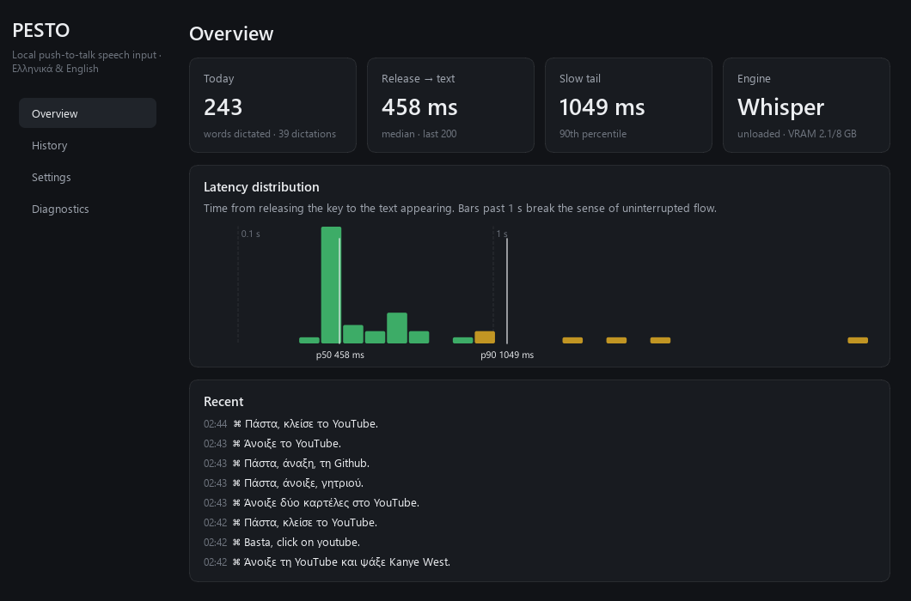
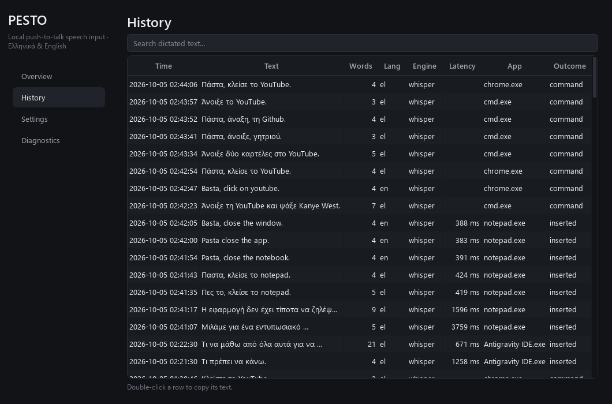
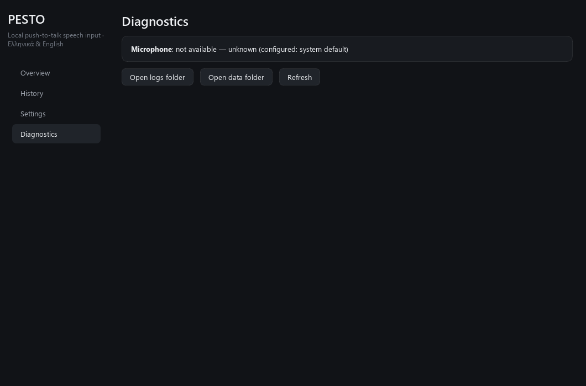
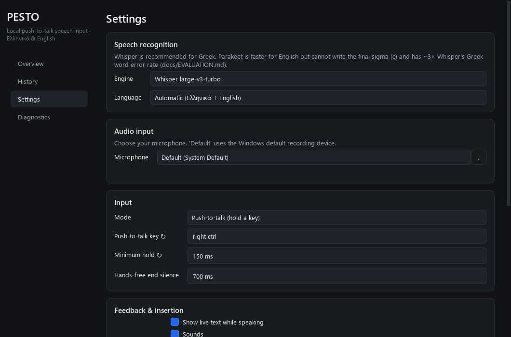

# PESTO + PASTA — Τεκμηρίωση (Ελληνικά)

> 🇬🇧 **English documentation**: [README.md](../../README.md) · [Architecture](../../docs/ARCHITECTURE.md) · [Evaluation](../../docs/EVALUATION.md) · [Study Protocol](../../docs/STUDY_PROTOCOL.md)

**PESTO**: πλήρως τοπική, δίγλωσση (ελληνικά/αγγλικά) φωνητική εισαγωγή κειμένου για Windows με push-to-talk. Κρατάς πλήκτρο, μιλάς, αφήνεις — και το κείμενο εμφανίζεται ακαριαία εκεί που βρίσκεται ο κέρσορας.

**PASTA**: επέκταση του PESTO για φωνητικές εντολές («Πάστα, άνοιξε το Chrome και ψάξε …»). Οι εντολές αναλύονται με ντετερμινιστική γραμματική υπο-χιλιοστού, γειώνονται στην πραγματική κατάσταση των Windows μέσω UI Automation, ελέγχονται ως προς την ασφάλεια, εκτελούνται και **επαληθεύονται**.

Όλα λειτουργούν **100% εκτός σύνδεσης (offline)** στην τοπική GPU μετά την πρώτη λήψη των μοντέλων. Το αποθετήριο αποτελεί την πειραματική πλατφόρμα της διπλωματικής εργασίας στο **Τμήμα Μηχανικών Η/Υ & Πληροφορικής (CEID), Πανεπιστήμιο Πατρών** με θέμα την αντιληπτή υστέρηση και τον γνωστικό φόρτο στην ελληνική φωνητική πληκτρολόγηση.

---

## 📸 Οπτική Περιήγηση & Διεπαφή Χρήστη

### Η Κάψουλα Κατάστασης (HUD) του PESTO

Η αιωρούμενη κάψουλα στο κάτω μέρος της οθόνης δεν παίρνει ποτέ την εστίαση (non-stealing focus) και παρέχει ζωντανή οπτική πληροφόρηση:

| Κατάσταση | Προεπισκόπηση HUD | Περιγραφή |
|---|---|---|
| **Ακρόαση (Listening)** |  | Πράσινες μπάρες έντασης φωνής σε πραγματικό χρόνο, ζωντανή ροή κειμένου και ένδειξη γλώσσας. |
| **Μεταγραφή (Transcribing)** |  | Περιστρεφόμενο τόξο προόδου σε ασύγχρονο, μη-μπλοκαριστικό νήμα GPU ASR. |
| **Ολοκλήρωση (Done)** |  | Άμεση πληκτρολόγηση με `SendInput` Unicode και ένδειξη μετρημένης καθυστέρησης (π.χ. `286 ms`). |

### Φωνητικές Εντολές & Έλεγχος Ασφαλείας του PASTA

Όταν η εκφώνηση ξεκινά με λέξη-αφύπνισης («Πάστα,» / «Pasta,»), δρομολογείται αυτόματα στον πράκτορα του PASTA:

| Φάση | Προεπισκόπηση HUD | Περιγραφή |
|---|---|---|
| **Εκτέλεση Βημάτων** |  | Ανάλυση εντολής σε επιμέρους βήματα με γείωση σε ανοιχτά παράθυρα και εφαρμογές. |
| **Επιβεβαίωση Ασφάλειας** |  | Διαδραστική πύλη ασφαλείας για ευαίσθητες ενέργειες (π.χ. κλείσιμο παραθύρων: `Enter` έγκριση, `Esc` ακύρωση). |
| **Επαληθευμένο Αποτέλεσμα** |  | Αναφορά εκτέλεσης με πραγματική επιβεβαίωση του αποτελέσματος και συνολικό χρόνο. |

### Πίνακας Ελέγχου (Dashboard) & Τηλεμετρία

Πλήρης πρόσβαση σε διαγνωστικά συστήματος, κατανομές καθυστέρησης και ρυθμίσεις από το εικονίδιο περιοχής ειδοποιήσεων:

| Επισκόπηση & Δραστηριότητα | Ιστορικό & Κατανομή Καθυστέρησης |
|:---:|:---:|
|  |  |
| **Διαγνωστικά & Υγεία Υλικού/GPU** | **Ρυθμίσεις & Επιλογή Μικροφώνου** |
|  |  |

---

## ⚡ Μετρήσεις & Πειραματικά Αποτελέσματα

Όλοι οι ισχυρισμοί βασίζονται σε αναπαραγώγιμες μετρήσεις στο σύνολο ελέγχου **FLEURS** (200 ελληνικές + 200 αγγλικές εκφωνήσεις, seed `20261004`, NVIDIA RTX 3050 8 GB, Windows 10/11). Αναλυτική μεθοδολογία: [`docs/el/EVALUATION.md`](EVALUATION.md) και [`docs/ENGINEERING_LOG.md`](../ENGINEERING_LOG.md).

### 1. Ακρίβεια Αναγνώρισης Ομιλίας (WER / CER)

| Μηχανή / Διαμόρφωση | Ελληνικά WER | Αγγλικά WER | Ελληνικά CER | Καθυστέρηση (p50) |
|---|---|---|---|---|
| **Αρχικό (v2)** *(auto LID, beam 2, ελληνικό prompt)* | 12,61 % [11,1–14,3] | **51,02 %** *(παραμόρφωση αγγλικών)* | 4,91 % | 804 ms |
| **Νέο PESTO v3 Whisper (beam 1)** | 13,09 % | 5,54 % | 5,11 % | 410 ms |
| **Νέο PESTO v3 Whisper (beam 2, προεπιλογή)** | **12,28 % [10,8–14,1]** | **5,52 %** | **4,57 %** | **450 ms** |
| **NVIDIA Parakeet TDT 0.6B (CUDA)** | 34,88 % *(έλλειψη ς)* | **5,96 %** | 11,30 % | **124 ms** |

> ℹ️ **Σημείωση για το Parakeet στα Ελληνικά**: Παρότι παρέχει αστραπιαία ταχύτητα στα αγγλικά (124 ms), το Parakeet **δεν περιέχει το τελικό σίγμα (ς) στο λεξιλόγιό του** (το 17,7% των ελληνικών λέξεων τελειώνει σε ς). Για δίγλωσση χρήση προτείνεται ανεπιφύλακτα το **Whisper Large-v3-Turbo**.

### 2. Βελτιστοποίηση Καθυστέρησης (Ζευγαρωτές Μετρήσεις ABBA)

Μετρήσεις σε 100 ζευγαρωτά αποσπάσματα (50 EL + 50 EN, Wilcoxon $p < 10^{-15}$):

* **Εκφώνηση 3 s (τυπική υπαγόρευση)**: Η καθυστέρηση μηχανής μειώθηκε από **804 ms → 450 ms** (διάμεση μείωση: **−351 ms [−357, −346]**).
* **Εκφώνηση ~10 s**: Μειώθηκε από **990 ms / 1332 ms (p50 / p95) → 562 ms / 879 ms**.
* **Ψυχρή Εκκίνηση (Εκκίνηση Διεργασίας → Πρώτο Κείμενο)**: Μειώθηκε από **8,1 s → 4,4 s** χάρη στην απομάκρυνση της φόρτωσης του PyTorch (`pesto/cuda.py`).
* **Πύλη Ομιλίας Silero VAD**: Χρειάζεται μόλις **~4 ms** για 3 s ήχου, απορρίπτοντας τα τυχαία πατήματα πλήκτρου χωρίς εκτέλεση του ASR.

### 3. Κατανόηση Εντολών & Ασφάλεια του PASTA

Αξιολογήθηκε σε 201 επισημασμένες εκφωνήσεις:

* **Αθέατες Ελληνικές Εντολές (held-out)**: **97,5 %** ακριβής αντιστοίχιση στην πρώτη εκτέλεση (**100 %** post-hoc).
* **Αθέατες Αγγλικές Εντολές**: **85,0 %** ακριβής αντιστοίχιση (**100 %** post-hoc).
* **Χρόνος Ανάλυσης Γραμματικής**: **<0,1 ms** (0,06 ms διάμεσος) έναντι 2–3 δευτερολέπτων ενός τοπικού LLM.
* **Παγίδες Υπαγόρευσης**: **0 %** εσφαλμένη εκτέλεση εντολής σε 30 προτάσεις υπαγόρευσης που περιείχαν ρήματα προστακτικής.
* **Επίπεδα Ασφαλείας**: `auto` (ακίνδυνες), `confirm` (με προειδοποίηση στο HUD) και `refuse` (επικίνδυνες).

---

## 🚀 Γρήγορη Εκκίνηση

### Εκτέλεση

```bash
PESTO.bat                  # Μόνο υπαγόρευση
PASTA.bat                  # Υπαγόρευση + φωνητικές εντολές
python -m pesto doctor     # Διαγνωστικός έλεγχος GPU, CUDA, μικροφώνου
```

### Χειρισμός & Συντομεύσεις

| Ενέργεια | Προεπιλογή | Περιγραφή |
|---|---|---|
| **Υπαγόρευση (PESTO)** | Κράτα **Right Ctrl** (≥150 ms) | Μίλα, άφησε και το κείμενο εμφανίζεται. Στιγμιαία πατήματα λειτουργούν ως κανονικό Ctrl. |
| **Εντολή (PASTA)** | Κράτα **Right Ctrl** | Ξεκίνα με **«Πάστα,»** ή **«Pasta,»** (π.χ. *«Πάστα, άνοιξε το Spotify»*). |
| **Ακύρωση** | **Esc** | Ακυρώνει την τρέχουσα εγγραφή ή εκτελούμενη εντολή. |
| **Επιβεβαίωση Εντολής** | **Enter** (ή πες «ναι» / «yes») | Εγκρίνει εντολή που ζητά επιβεβαίωση ασφάλειας. |
| **Εναλλαγή Γλώσσας** | **Ctrl+Alt+Shift+L** | Αυτόματη, Ελληνικά (`el`), Αγγλικά (`en`). |
| **Εναλλαγή Μηχανής** | **Ctrl+Alt+Shift+E** | Εναλλαγή μεταξύ Whisper Large-v3-Turbo και Parakeet TDT. |
| **Εναλλαγή Λειτουργίας** | **Ctrl+Alt+Shift+M** | Εναλλαγή μεταξύ μόνο υπαγόρευσης και φωνητικών εντολών. |

---

## 🏛️ Οργάνωση Αρχιτεκτονικής

```
pesto/                 Πυρήνας: Φωνητική Εισαγωγή
  hotkeys.py           Low-level Win32 keyboard hook (κωδικοί virtual-key)
  audio.py             Συνεχής ροή ήχου με 300 ms προ-εγγραφή και αυτόματη επανασύνδεση
  session.py           Συντονιστής συνεδρίας & αποκλειστικό νήμα εκτέλεσης GPU ASR
  asr/                 Μοντέλα: Whisper Large-v3-Turbo, Parakeet TDT, Silero VAD gate
  inject.py            Εισαγωγή κειμένου SendInput Unicode (το πρόχειρο μένει ανέπαφο)
  telemetry.py         Καταγραφή χρονοσήμων και καθυστέρησης σε SQLite WAL
  ui/                  PyQt6 HUD, εικονίδιο tray, και Dashboard

pasta/                 Επέκταση: Φωνητικές Εντολές
  router.py            Διαχωρισμός υπαγόρευσης από εντολή βάσει wake-words
  nlu/grammar.py       Ντετερμινιστική δίγλωσση γραμματική (<0,1 ms)
  intents.py           Τυποποιημένος κατάλογος ενεργειών (εφαρμογές, παράθυρα, browser, ήχος)
  planner.py           Γείωση στα ανοιχτά παράθυρα και εγκατεστημένες εφαρμογές
  safety.py            Πολιτική ασφάλειας 3 επιπέδων: auto / confirm / refuse
  executors.py         Εκτελεστές με επαλήθευση αποτελέσματος (verified / unverified / failed)
  world/               Παρατήρηση επιφάνειας εργασίας (Windows UI Automation, ήχος, shell)

research/              Ερευνητική Πλατφόρμα & Μελέτη Χρηστών
  asr_eval.py          Εργαλείο αξιολόγησης FLEURS (WER, CER, διαστήματα εμπιστοσύνης)
  latency_ab.py        Εργαλείο ζευγαρωτής μέτρησης καθυστέρησης ABBA
  study/               Πλατφόρμα εκτέλεσης μελέτης χρηστών (NASA-TLX, Latin Square, WPM)
```

---

## 🔒 Ιδιωτικότητα & Ασφάλεια

* **Μηδενική Εξάρτηση από το Cloud**: Ο ήχος δεν αποστέλλεται ποτέ εκτός του υπολογιστή. Όλα τα μοντέλα εκτελούνται τοπικά.
* **Ακεραιότητα Προχείρου (Clipboard)**: Η εισαγωγή κειμένου γίνεται με συνθετικά συμβάντα πληκτρολογίου `SendInput` Unicode. Το πρόχειρο των Windows δεν διαβάζεται και δεν αλλοιώνεται.
* **Τοπική Τηλεμετρία**: Όλα τα δεδομένα μετρήσεων αποθηκεύονται τοπικά στο αρχείο SQLite (`data/pesto.db`).

---

## 🎓 Ακαδημαϊκό Πλαίσιο & Διπλωματική Εργασία

Το έργο αναπτύχθηκε στο πλαίσιο Διπλωματικής Εργασίας στο **Τμήμα Μηχανικών Η/Υ & Πληροφορικής (CEID), Πολυτεχνική Σχολή, Πανεπιστήμιο Πατρών**:

* **Τίτλος Εργασίας**: *Αντιληπτή Υστέρηση και Γνωστικός Φόρτος σε Push-to-Talk Ελληνική Φωνητική Πληκτρολόγηση: Συγκριτική Μελέτη με Παραδοσιακό Πληκτρολόγιο σε Ακαδημαϊκό Περιβάλλον*
* **Φοιτητής**: Γιάννης Μαργέτης
* **Ίδρυμα**: Πανεπιστήμιο Πατρών, Τμήμα Μηχανικών Η/Υ & Πληροφορικής
